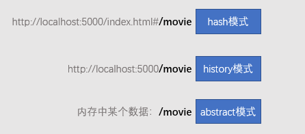

# vue路由 {ignore}

一个站点由很多页面组成，需要在不同的页面之间切换

在vue中，可以把每个页面看作是一个组件，页面的切换，实际上就是组件的切换显示

除了可以手动的实现组件切换，还可以利用vue路由

# 安装

vue路由的核心功能，就是根据不同的页面地址，切换到不同的组件进行显示


要实现这一点，需要用到`vue-router`库

1. **在页面上引入`vue-router`库**
2. **创建一个VueRouter对象**

`vue-router`库提供了一个构造函数`VueRouter`，通过它可以创建一个对象

```js
var router = new VueRouter({
  //配置
})
```

配置中，将提供路由的各种信息，比如什么地址对应什么组件

3. **将创建的对象配置到vue实例中**

接下来，你需要将刚刚创建好的对象配置到vue实例中

```js
new Vue({
  // 其他配置
  router
})
```

这样一来，vue中就加入了路由的功能

# 组件切换的位置

现在，你需要告诉vue，当地址变化时，在**何处切换组件**

当vue中配置了`VueRouter`对象后，会自动的全局注册一些组件

其中一个组件名为`RouterView`

该组件的作用，是用于标记**组件在哪里进行切换**

```html
<div>
  <!-- 头部不动 -->
  <header>
    <a href="#/">首页</a>
    <a href="#/movie">电影</a>
  </header>
  <!-- 仅在这里切换组件 -->
  <router-view />
</div>
```

# 路由规则配置

在创建`VueRouter`实例时，可以填写很多配置，其中最重要的，就是**路由规则配置**

```js
new VueRouter({
  // 路由规则是一个数组，数组中每一项是一条规则
  routes: [
    { //规则1
      name: "home", // 规则名称，随便取一个容易记忆的名称，可以不写
      path: "/",  // 当匹配到路径 / 时
      component: Home // 在 router-view 位置渲染 Home 组件
    },
    { //规则2
      name: "movie-list",  // 规则名称，随便取一个容易记忆的名称，可以不写
      path: "/movie",  // 当匹配到路径 /movie 时
      component: Movie  // 在 router-view 位置渲染 Movie 组件
    }
  ]
})
```

此时，当你访问`index.html#/`时，将看到首页，访问`index.html#/movie`时将看到电影页

# 路由模式配置

**使用何种路由模式，决定了路由从哪里读取地址**

vue-router支持三种模式：

- hash【默认值】
- history
- abstract



无论是什么模式，vue-router最终会拿到地址，然后根据路由配置切换组件

> hash模式兼容性最好
> history模式地址更优雅，但兼容性稍差，并且需要`webpack`的开发服务器配合才能完整的实现
> abstract模式可以适用于任何环境，如`node`、`移动端`，浏览器端也能用，不过由于地址变化发生在内存，无法从地址栏感知到

# 路由跳转

## 超链接跳转

### router-link组件

除了使用`a`元素跳转页面，还可以使用`vue-router`提供的组件`router-link`

虽然该组件最终也会呈现为一个`a`元素，但使用它更利于代码的维护

```html
<router-link to="/">首页</router-link>
<router-link to="/movie">电影页</router-link>
```

router-link会根据路由的模式，自动生成对应的`a`元素，上面的代码最终生成

```html
<a href="#/">首页</a>
<a href="#/movie">电影</a>
```

这样一来，就**解除了链接和模式的耦合**，模式的变化，不会影响链接的书写

### 匹配的类样式

`router-link`组件还会**匹配当前的地址和链接的地址**，如果能够匹配，则会自动的添加一个类样式，这非常有利于我们通过样式来控制超链接的选中状态

比如，当前访问的地址是`index.html#/movie`

则生成的`a`元素是:

```html
<a href="#/" class="router-link-active">首页</a>
<a href="#/movie" class="router-link-exact-active router-link-active">电影</a>
```

- router-link-active，该类样式只要开始部分匹配上即会添加
- router-link-exact-active，该类样式只有全部匹配上才会添加

### 命名路由

如果在配置路由规则的时候，给某个路由规则指定了`name`，则该路由叫做命名路由

`router-link`组件允许你通过`name`的值生成`a`元素

```html
<router-link :to="{name:'home'}">首页</router-link>
<router-link :to="{name:'movie-list'}">电影页</router-link>
```

生成的结果

```html
<a href="#/">首页</a>
<a href="#/movie">电影</a>
```

这样一来，又解除了路径和链接的耦合，将来路径的变化不会影响到链接的代码

## 代码跳转

有的时候，我们可能需要用代码的形式来完成跳转

除了`location.href`的传统方式外，`vue-router`还提供了一套API来帮助你完成这件事

和`a`元素的替代方案一样，利用这些API跳转页面，更利于代码的维护

> 在history和abstract模式中，必须使用这些API跳转页面

`vue-router`在vue实例中注入了两个属性：`$route`和`$router`

### $route

该属性是一个对象，记录了当前匹配的信息

例如访问地址为`http://localhost:5000/index.html#/movie?page=1&limit=2#abc`

在组件中打印出`this.$route`将会得到

```js
{
  name: "movie-list", // 匹配到的路由名称
  path: "/movie", // 匹配到的路径
  hash: "#abc", // 路径的hash部分
  query: {page: "1", limit: "2"}, // 路径的query部分
  fullPath: "/movie?page=1&limit=2#abc" // 匹配到的完整地址
}
```

> `$route`中还有一些信息，需要到进阶才能理解

### $router

该属性仍然是一个对象，对象中提供了一些方法用于跳转路由

```js
this.$router.push("/movie")  // 跳转到路径 /movie 
this.$router.push({
  name:"movie-list"
})  // 跳转到命名路由 movie-list
this.$router.go(-1)  // 类似于 history.go(-1)
this.$router.back() // 等同于 this.$router.go(-1)
this.$router.forward() // 等同于 this.$router.go(1)
```

> `$router`中还有一些信息，需要到进阶才能理解

# 动态路由

假设有一个电影详情页，详情页需要根据电影的id来获取电影对象，然后渲染组件

那么电影详情页的地址中就需要包含电影的id

比如`/movie/1`，这样的地址要匹配到详情页，并且`1`表示要显示的电影的id；`movie/2`，这样的地址也要匹配到详情页，并且`2`是电影的id

这里就涉及到三个问题：

1. 如何把动态地址（地址某一部分会变化）匹配到组件
2. 如何在组件中获取到动态部分的内容
3. 路由跳转时，如何优雅的告知动态内容

### 匹配动态地址

在路由规则的配置中，`path`的配置实际上并不简单的是一个字符串，而是一个符合`glob pattern`规则的字符串

> glob pattern 是一个类似于正则表达式的字符串

只要访问的地址匹配上了`path`，就能匹配到对应的组件

所以，可以用以下代码来书写一个动态地址

```js
{
  path: "/movie/:id", // :id 是动态的部分，id是动态部分的名字
}
```

这样一来，如果访问`/movie/3`，则会匹配上这个规则，同时，`vue-router`会把`3`记录下来，放到名为`id`的属性中

### 获取动态内容

只要匹配到了动态地址，动态部分的数据就已经被记录下来，放到了`$route.params`属性中

只需要到该属性中获取即可

比如要获取id的值：

```js
this.$route.params.id
```

### 路由跳转时传递动态内容

```html
<router-link to="/movie/4">电影详情页</router-link>
<router-link :to="{name:'movie-detail', params:{ id: 4 }}">电影详情页</router-link>
```

```js
this.$router.push("/movie/4");
this.$router.push({
  name:"movie-detail",
  params:{
    id:4
  }
})
```