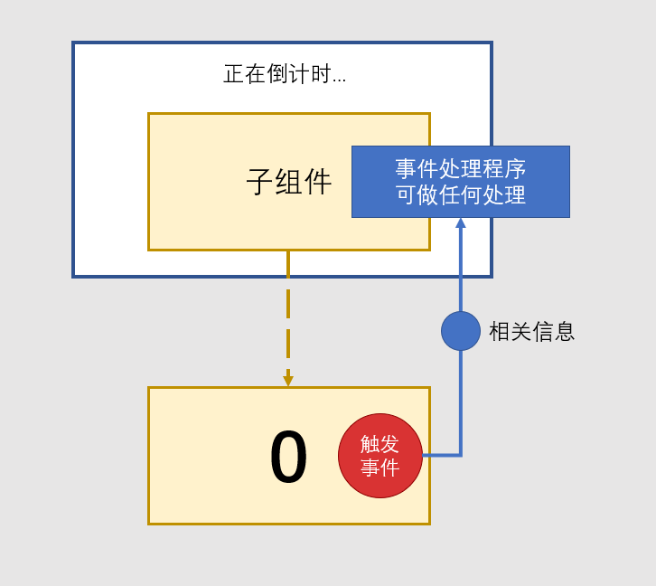
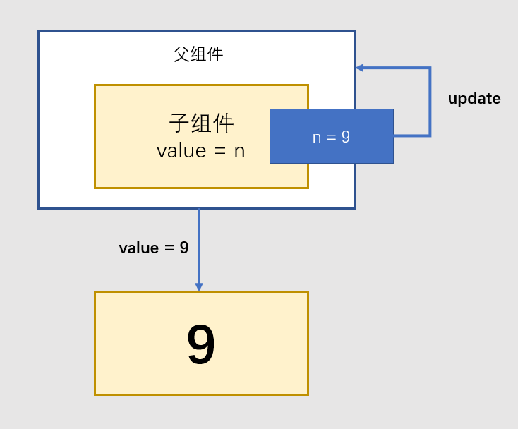
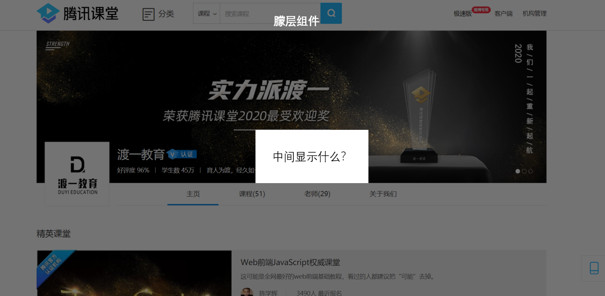

# 深入组件 {ignore}

# 属性约束

参考[官网描述](https://cn.vuejs.org/v2/guide/components-props.html#Prop-%E9%AA%8C%E8%AF%81)

# 组件事件

组件之间经常都会发生消息的传递，我们称之为**组件通信**

prop是组件通信的一种，消息从父组件传递到子组件

但还有一些场景，就是子组件中发生了一件事，可是它没有能力处理这件事，需要使用它的人来处理，此时，就需要**事件 event**

例如，倒计时组件停止了，可是停止之后干嘛呢？在不同的场景要做不同的事情，可能什么也不做，可能在页面上显示倒计时结束了，也可能把计时器组件销毁掉，也可能另一个组件会变化？

无论是哪种情况，都超出了计时器组件的控制能力

所以，计时器组件在计时结束后，抛出一个事件，事件可以让父组件收到通知，于是父组件可以站在更高的层面来处理这个问题



子组件中抛出一个事件，称之为**触发事件**

在父组件中为子组件设置事件处理程序，称之为**注册事件**

触发事件的代码

```js
this.$emit("事件名", 额外参数)
```

注册事件的代码

```html
<my-comp 事件名="处理函数">
```

> 属性和事件是组件间最常见的通信方式，除此之外，组件之间还有很多其他的通信方式，用于解决一些特殊问题

## v-model

如果一个计时器组件，它当前显示的数字，需要被外部控制，那么显示的数字就不能作为状态，而要作为属性，因为状态外部控制不了。

而这样一来，该计时器组件如何实现计时更新呢？

正确的方式是，让该组件希望更新属性时，抛出一个事件，让父组件处理

```js
var Timer = {
  props:["value"],
  data(){
    return {
      timerId: null
    }
  },
  created(){
    this.timerId = setTimeout(()=>{
      this.$emit("input", this.number - 1);
      //是否计时完成
    }, 1000)
  },
  template: `<h1>{{}}</h1>`
}
```

父组件可以处理该事件，并给予新的属性

```js
var Parent = {
  components:{Timer},
  data(){
    return {
      n:10
    }
  },
  template: `<Timer :value="n" @input="n=$event"/>`
}
```




实际上这是一个非常简单的流程，即：

1. 子组件想更新数据，通知父组件
2. 父组件直接更新数据

为了简化这一流程，只要子组件的属性是`value`，事件是`input`，父组件可以用使用`v-model`直接实现数据绑定

```html
<Timer v-model="n"/>
<!-- 完全等同于 -->
<Timer :value="n" @input="n=$event"/>
```

# 插槽

有的时候，组件中某一部分内容不知道要显示什么，它可能什么也不显示，也可能要显示另一个组件，又或者要显示一个标签，又或者要显示一个文本

例如，一个朦层组件，它仅仅是提供一个朦层，在朦层中间显示什么并不确定



此时，就可以使用插槽

```js
// 朦层组件
var Modal = {
  template: `
    <div class="modal">
      <!-- 朦层中间区域 -->
      <div class="center">
        <!-- 不知道要显示什么，使用插槽 -->
        <slot>插槽默认值</slot>
      </div>
    </div>
  `
}
```

在使用朦层组件时，如果元素内部的内容将传递给slot

```html
<modal>
  加载中...
</modal>
```

如果没有传递元素内容，则会使用slot的默认值

> 插槽还有很多高级用法

