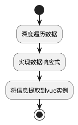

# vue入门 {ignore}

# 前言

1. 6天的目标是什么？

- 能够使用vue开发大部分应用的常见功能
- 对vue的核心原理有一定认识

2. 需要的知识

html+css知识

javascript知识

部分ES6知识（本节课需要用到`字符串模板、速写方法、速写属性`）

3. 如何学习？

- 理解老师讲的内容
- 课后**独立**完成课堂上的练习
- 如果还有额外的精力，自行脑补更多的功能，并尝试实现

4. 编辑器和插件

编辑器：vscode，visual studio code

插件：live server，自动搭建一个简易的本地服务器，可以从服务器访问页面

5. vue是什么？

> vue的官网：https://cn.vuejs.org/

vue是一个**渐进式**的**javascript框架**

**渐进式**：vue可以和其他传统（比如jquery）前端技术融合，这意味着你可以向已有工程中逐步植入vue，而无须全部重写

**javascript框架**：基于JS语言书写而成的框架，框架是一种升级版的库，它具有约束力，即必须按照框架所规定的方式组织代码结构

目前，vue的主版本号为`2`，`vue3`正在测试中，预计今年第一季度发布正式版

# 基本原理

## 创建vue工程

创建vue工程有三种方式：

1. 和传统工程一样，创建页面，引入`vue.js`即可
2. 使用构建工具（`webpack`）搭建工程
3. 使用脚手架（`vue-cli`）搭建工程

## 创建vue实例

先在页面中放置一个div

```html
<!-- 这个div将会被vue控制 -->
<div id="app"></div>
```

`vue.js`提供了一个构造函数`Vue`，通过下面的代码即可创建一个vue实例：

```js
new Vue({ //配置对象
    el: "#app",
    data: {
        title: "商品和库存管理"
    },
    template: `
        <h1>{{title}}</h1>
    `
})
```

配置对象中出现了三个属性：

- **el**: 表示vue实例将控制页面中的哪个元素(**要挂载的元素**)。该元素将被vue控制，元素之外的其他区域不受影响。
- **data**：一个对象，可以配置任何**与显示相关的数据**。这是非常重要的一个配置，它为被vue控制的区域提供需要显示的信息，至于如何显示，则由`template`的内容决定
- **template**：渲染**模板**。它描述了要显示到页面上的内容，该内容经过一系列流程后，最终将**替换**掉`el`元素。
  - 值得注意的是，vue要求**模板必须有唯一的根节点**。
  - 如果没有配置`template`，vue将使用`el`元素的`outerHTML`作为模板

## 数据响应式

vue的数据是响应式的。

所谓响应式，**是指当数据发生变化的时候，vue会重新渲染**

vue2实现响应式的方式，是深度遍历配置中的`data`，将遇到的每一个属性用`Object.defineProperty`的方式重新定义，于是，每当读取属性或给属性赋值时，vue可以收到通知，从而渲染界面

不仅如此，为了对数组进行响应，vue还重写了大部分改变数组的方法，例如`push、slice、splice、pop、shift、unshift等`，于是，对数组的操作也具有了响应式。

> 但是，如果直接通过索引改动数组的某个元素是不具有响应式的，但可通过`实例.$set(target, prop, value)`实现设置

为了方便操作数据，vue还会将配置中的一些信息提取到vue实例中

**我们把添加数据响应式功能，以及提取到vue实例的过程称之为注入**


<p class="markdown-img-description">
    注入流程
</p>

> 由于注入流程发生在最开始的时候，如果之后动态的增加数据，由于注入流程已经结束，增加的数据无法获得响应式

## 模板的编译

如果每次重新渲染都完全替换页面中的元素，将导致效率极其低下

> 对真实DOM的操作非常昂贵

vue为了提高渲染效率，使用**虚拟DOM**的方式来映射真实的DOM。

> 虚拟DOM实际上就是一个普通的JS对象。当需要重新渲染的时候，vue首先检查这些虚拟DOM哪些是需要更改的，从而根据实际情况，用最小的代价更新真实DOM。

**模板字符串变成虚拟DOM的过程，称之为模板的编译**

> 模板的编译是一个复杂的过程，要完全理解它的原理，需要熟悉源码和一些算法

在模板中，**我们可以使用所有vue实例中的属性和方法**

# 模板和配置

## 模板

### 插值

在所有文本节点的位置，都可以使用`Mustache`语法进行插值

```vue
{{ 任何JS表达式 }}
```

### 指令

在所有元素节点的属性位置，都可以使用各种指令来完成不同的操作

指令的完整语法是：```指令名:指令描述.指令修饰符```

> 可以把指令想象成某个函数，指令描述和指令修饰符是函数的一些参数，用于告知函数一些具体的信息
> 如果要查看所有的指令，参阅官网API文档

1. **v-on**

通过该指令，可以为节点注册事件

```html
<!-- 点击后执行某段JS代码 -->
<button v-on:click="JS代码">按钮</button>
<!-- 点击后执行某段JS代码，并阻止默认行为 -->
<a href="" v-on:click.prevent="n++">链接</a>
```

由于使用频繁，`v-on:`可以速写成`@`

在`v-on`指令内部，可以使用`$event`获取获取事件参数

2. **v-bind**

通过该指令，可以为元素绑定属性

```html
<!-- img元素的图片地址来自于数据：url -->

<!-- div元素的类样式来自于一个判断 -->
<div v-bind:class="phone?'container-phone':'container'"></div>
```

由于使用频繁，`v-bind:`可以速写成`:`

3. **v-if**

这里涉及三个指令`v-if、v-else-if、v-else`，类似于js的`if、else if、else`

```html
<p v-if="score<60">不及格</p>
<p v-else-if="score<80">及格</p>
<p v-else>优秀</p>
```

**v-if决定该元素是否参与渲染**

4. **v-show**

该指令接收一个`boolean`表达式，**用于决定该元素是否隐藏**

```html
<p v-show="score<60">不及格</p>
<p v-show="score<80 && score>=60">及格</p>
<p v-show="score>=90">及格</p>
```

5. **v-html**

通过该指令可以设置元素的`innerHTML`

```html
<p v-html="`<a href=''>链接</a>`">内部的内容不再有效</p>
```

6. **v-for**

通过该指令，可以循环渲染元素

```html
<!-- nums: ["a","b","c"] -->
<ul>
    <!--  -->
    <li v-for="(n i) in nums" :key="i">{{i}}, {{n}}</li>
</ul>
```

渲染后

```html
<ul>
    <li>0, a</li>
    <li>1, b</li>
    <li>2, c</li>
</ul>
```

key值的设置是为了提高渲染效率，通常在循环渲染一个元素时设置，设置的值必须唯一，**通常设置为数据的id**

> 在重新渲染时，vue底层需要对比新旧两棵虚拟DOM树，key值的存在可以让vue更加精准的比较，从而减少对真实DOM的操作

7. **v-model**

该指令用于对数据进行双向绑定

```html
<!-- 文本框显示txt的内容 -->
<!-- 当文本框触发input事件时，会更改txt的内容 -->
<input type="text" v-model="txt">

<!-- 上面的代码等同于 -->
<input type="text" :value="txt" @input="txt=$event.target.value">
```

## 配置

1. **el**

要挂载的元素

2. **data**

要渲染的数据

3. **template**

要编译的模板

4. **methods**

`methods`中可以配置一些函数，这些函数会被提取到vue实例，因此:

- **函数中的this指向的是vue实例**
- **模板中可以调用函数**
- **可以将函数设置到事件**

```js
new Vue({
    //...
    data:{
        n: 0
    },
    methods:{
        add(number){
            this.n += number;
        },
        reduce(number){
            this.n -= number;
        }
    }
})
```

在模板中可以使用这些方法

```html
<button @click="reduce(2)"> 减2 </button>
{{n}}
<button @click="add(3)"> 加3 </button>
```

5. **computed**

computed中可以配置一些方法，这些方法称之为计算属性

```js
new Vue({
    data:{
        firstName: "姬",
        lastName: "成"
    },
    computed:{
        // 计算属性fullName
        // 当读取fullName时，会调用该方法得到结果
        fullName(){
            return this.firstName + this.lastName;
        }
    }
})
```

计算属性也会提取到vue实例，因此：

- **方法中this指向vue实例**
- **模板中可以直接使用计算属性，使用时当作普通属性使用即可，不能当作方法调用**

```html
<p>{{fullName}}</p>
```

计算属性和方法的最大区别，在于计算属性会进行缓存，只要依赖不变，计算属性的方法无须重新运行

